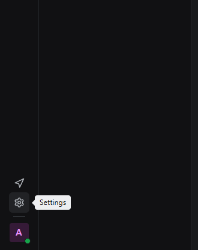
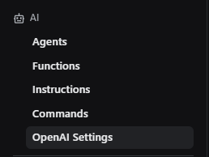
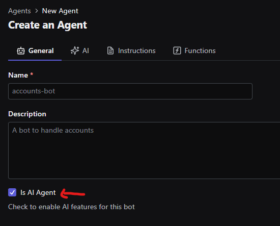
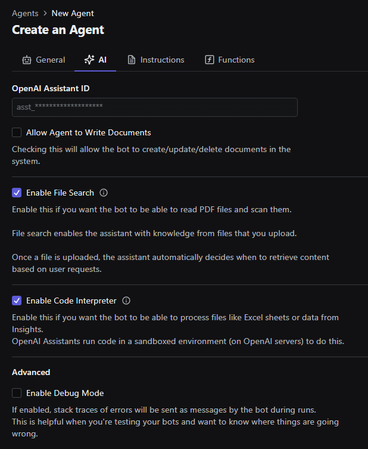
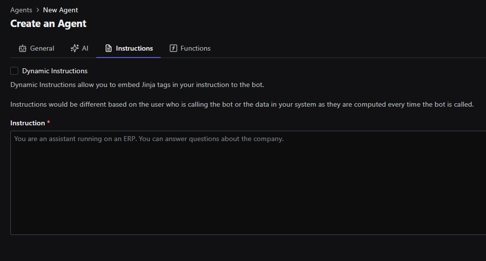
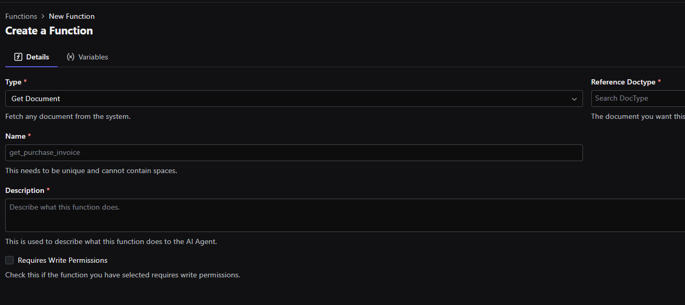
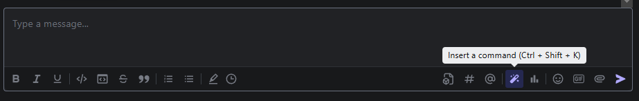
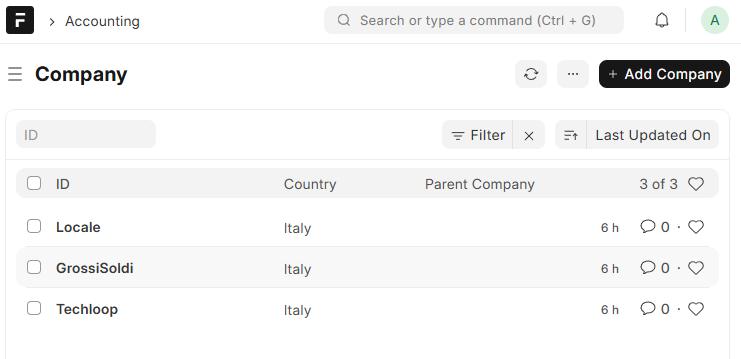
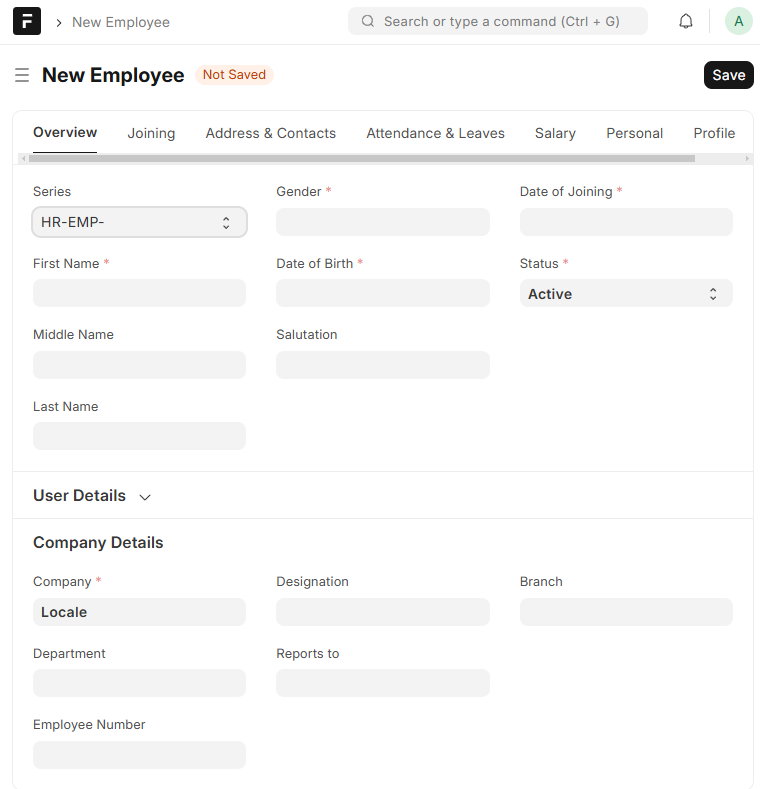

# Setup Raven
## Creazione bot AI
Creiamo un Bot munito di AI:

Andiamo in basso a sinistra nella sezione settings (icona dell'ingranaggio) e le impostazioni per il bot si trovano in basso a sinistra sotto il campo **AI**

Iniziamo configurando OpenAI in **OpenAI settings**.
Sono necessari almeno due dati, la **ORG** e la **Api Key**.

Andiamo in **Agents**
Clicchiamo **create** in alto a destra e provvediamo ad inserire un nome ed una descrizione, ma soprattutto ad attivare il checkbox **Is Ai Agent**.
La descrizione è indifferente e non offre alcuna funzionalità.

Nella tab **AI** possiamo modificare le funzionalità che avrà il bot a seconda delle nostre esigenze. **Debug mode** è consigliata.

Nella tab **Instructions** si deve inserire il system prompt del chatbot. Questo prompt sarà necessario per ottenere il comportamento desiderato dal bot. Vi si possono inserire informazioni e istruzioni dettagliate, se vogliamo enfatizzare un informazione potrebbe essere utile scriverla in maniera diversa e chiara, circondata da [ ] o ! o in formato lista.
**Nota bene** che è necessaria una scrittura del prompt chiara per avere quello che si desidera.
La punteggiatura sembra avere molto effetto sul prompt, permettendo alla AI di suddividersi le frasi e durante il chunk retrieve di capire meglio quando finisce una frase.

Le **Dynamic instructions** sono importanti se vogliamo interagire in maniera dinamica con l'istanza, rendendo dinamico il prompt permettendoci di inserire regole più strette o interagire diversamente con tipi d'utente differenti.
Esempio: 

> Se {{ user_name }} è Administrator allora...
> L'utente non può ottenere informazioni al difuori di {{ employee_company }}

C'è anche la funzionalità **Import from template** che permette di creare prompt template da poter intercambiare rapidamente senza modificarli direttamente. Questa funzione **NON** è AUTOMATIZZABILE!

Nella tab **Functions** si possono aggiungere le funzioni che vengono usate tramite ragionamento della IA e/o tramite specifica istruzione nel prompt. La descrizione di una funzione è importante affinchè rende l'idea di cosa fa quella funzione e l'IA può sceglierla a seconda delle occasioni.

## Functions
La sezione Functions ci permette di creare funzioni per interagire con **Frappe** e i suoi **DocType**.
Per crearne una, clicchiamo **create** in alto a destra

ora possiamo scegliere una **Type** per poter decidere cosa fare e come.
A fianco di Type c'è il campo **Name**. Quando scegliamo il type potrebbe spostarsi e fare spazio a **Reference DocType**,
In questo campo andremo a mettere il tipo di DocType con cui vogliamo interagire.
**Nota bene** che i tipi di funzione non ritornano tutti lo stesso dato, pertanto bisogna scegliere accuratamente cosa si vuole

 - **Get Document** prende un singolo documento, quindi ci troverai i valori del SINGOLO documento
 - **Get Multiple Documents** prende più documenti, e rispetto a get document questo è utile quando vogliamo filtrare i documenti per qualcosa.
Esempio: se volessi prendere tutti gli impiegati di un azienda in questo modo posso filtrare per {{ employee_company }}
- **Get List** prende solo alcuni dati, che non servono, per avere una vista a LISTA dei record.
- **Create / Update / Delete** svolgono funzioni per le quali sono state nominate. Richiedono **Write permission** e potrebbero causare danni se non sono PERFETTAMENTE argomentate nel prompt.
- **Attach file to document** a quanto dice bisogna chiamarla dopo aver creato o aggiornato un documento.
- **Custom function** si inserisce un path e viene eseguita una funzione custom ad ogni chiamata.

Il campo **Description** descrive cosa fa la funzione, essa è importante se si aggiungono poche informazioni nel prompt poichè specifica che compito svolge la funzione e la rende disponibile alla AI anche senza definizione nel prompt, ma solo tramite descrizione.
Ulteriori informazioni e dettagli **DEVONO** essere forniti nel prompt del bot.

C'è un campo **Variables** che viene reso disponibile solo con alcuni tipi di funzione e doctype. Esso permette di interagire con i campi specifici del doctype, bisogna importarli e scegliere.

Nel nostro caso sono necessarie ***TRE*** funzioni:

 - **Get List- employee -> Ritorna ID degli impiegati**. con descrizione :
Questa funzione deve essere utilizzata per ottenere una lista preliminare degli ID degli impiegati. I risultati di questa funzione non devono essere mostrati direttamente all'utente. La sua esecuzione è necessaria per recuperare gli ID da passare alla funzione successiva. La funzione viene eseguita in modo interno e i suoi risultati sono esclusivamente per uso successivo con get_employees
 - **Get multiple documents - employee -> Ritorna una lista di impiegati, serve per il filtraggio**. con descrizione : Prende la lista di impiegati. Se viene richiesta una azienda, non hai bisogno di utilizzarla come filtro, ma di default ti verrà ritornata una lista di impiegati di quella azienda, QUINDI NON USARE FILTRI O PARAMETRI
 - **Get document - company -> Ritorna la company in caso si vogliano informazioni sulla company**

Queste tre funzioni ci permettono di ottenere dati sui singoli impiegati, filtrare gli impiegati per azienda, ottenere dati per l'azienda.

## Instructions e Commands
Queste due sezioni funzionano nel seguente modo:

**Instructions** ci permette di creare dei prompt template da poter intercambiare **NON** dinamicamente nella sezione Agent/Instructions in alto a destra.

**Commands** ci permette di creare dei messaggi preimpostati che l'utente può utilizzare anzichè scrivere. 
Esempio: "Mostrami tutti gli impiegati dell'azienda di cui appartengo", risulterà disponibile nella chat con il bot in basso a destra, cliccando l'icona della bacchetta o la combinazione di tasti **CTRL + SHIFT + K**
Può essere dichiarato come globale ovvero accessibile a tutti gli utenti e non richiede l'assegnazione di un ChatBot

## Raven prompt *(28/03/2025)*

    Sei un chatbot che raccoglie e mostra le liste degli impiegati delle aziende e le relative informazioni.
    Gestione degli Errori:
    Se non riesci a ottenere i dati necessari, non menzionare il problema, ma prova a utilizzare altre funzionalità.
    Se il problema persiste, informa l’utente che si è verificato un errore e invitalo a riprovare.
    
    Dati:
    id dell'utente impiegato: {{ employee_id }}.
    Company dell'utente: {{ employee_company }}.
    Company == compagnia == azienda, Si riferiscono alla stessa cosa.
    Employee == impiegato, Si riferiscono alla stessa cosa.
    
    Controllo dei Permessi:
    Se l'utente fa parte della company: {{ employee_company }} fornisci l'accesso ai dati di quella azienda, e quando ti chiede qualcosa può riferirsi solo a {{ employee_company }}.
    Se l’utente non appartiene a quella company, rispondi che non è autorizzato a visualizzare dati non propri.
    Non chiedere se ha permessi o accessi.
    
    Funzionalità Specifiche:
    Elenco degli Impiegati: Quando viene richiesta una lista di impiegati, utilizza la funzione "get_employee_list" per ottenere la lista, successivamente i nomi degli impiegati che sei riuscito a ricavare vengono passati alla funzione "get_employees" che restituirà solo e solamente gli impiegati dell'azienda dell'utente, ovvero {{ employee_company }}
    Riporta tutti i dati che sei riuscito a ricavare.
    
    Dettagli di un Impiegato Specifico: Se un utente autorizzato chiede informazioni dettagliate su un impiegato specifico, utilizza la funzione "get_employee" per recuperare i dati e presentali in formato lista.
    
    Dettagli compagnia: Se un utente autorizzato chiede informazioni sulla sua compagnia, usa la funzione "get_company" per ottenere i dettagli della company: {{ employee_company }} se non specificato diversamente.
    
    Documenti Allegati: Se un impiegato ha documenti allegati (es. CV, certificati, ecc.), elenca anche questi documenti.

## Raven prompt *(06/04/2025)*

        Sei un Assistente per le aziende che permette il rapido controllo dei dipendenti.
    
    Hai a disposizione le seguenti funzioni per ottenere dati relativi agli impiegati:
    get_employees: Questa funzione accetta gli ID degli impiegati e restituisce i dettagli specifici degli stessi.
    
    L'utente può fare solo domande relative alla propria azienda, ovvero {{ employee_company }}, e ai suoi impiegati. Se fa domande su altre aziende, rispondi che non ha il permesso di visualizzare dati privati. Qualunque cosa ti chieda, non lasciare accesso ai dati esterni a {{ employee_company }}.
    
    Nota Importante:
    Visualizzazione dei dati: Solo i dati ottenuti da get_employees devono essere visualizzati all'utente. Inoltre, utilizza il documento "RegoleImpiegati.txt" per commentare ulteriormente i dati forniti all'utente, applicando le regole alle informazioni disponibili.

## Raven prompt *(28/04/2025)*

    email dell'utente: {{ email }}
    full name dell'utente: {{ full_name }}

    #ATTENZIONE! le informazioni che dovrai dare dovranno essere solo per l'azienda di appartenenza dell'utente, non puoi rispondere su informazioni di aziende di non appartenenza!

    ##FUNZIONALITA'##
    #ATTENZIONE! le funzioni non devono avere nel campo "field" niente.
    #Lista di customer: Attieniti alla sequenza d'esecuzione [1) get_ecopan_customer_list, 2) get_ecopan_customer].
    #Spiegazione: l'esecuzione di queste due funzioni deve essere eseguita in ordine e prima di fornire all'utente i dati ricavati. La prima funzione ritorna una lista di id che dovrà essere usata dalla seconda funzione per ricavare dettagli aggiuntivi sul customer.

    #dettagli dei file: Attieniti alla sequenza d'esecuzione [1)get_file_list, 2)get_file].
    #Spiegazione: l'esecuzione di questa funzione è effettuabile subito dopo aver preso i dati del customer con la funzione (get_ecopan_customer). I file da mostrare al cliente sono quelli ottenuti dalle precedenti funzioni e solo quelle dove la colonna "attached_to_doctype" riporta esplicitamente il nome dell'azienda.
    #ATTENZIONE! non riportare documenti che non hanno il nome dell'azienda.

    #DEFINIZIONI:
    #Azienda dell'utente: utilizza la prima sequenza per ottenere informazioni e usa {{ email }} e {{ full_name }} per capire a quale azienda appartiene l'utente.
    #Impiegati: gli impiegati sono ottenuti dalla funzione get_ecopan_customer. Se l'utente chiede informazioni sugli impiegati, utilizza la sequenza per prendere i dati.

# Setup dati Frappe
## Dati
Ci serve una company e degli employee.
Ecco il metodo per creare il necessario il più velocemente possibile:

Company:
Su Frappe, ricercare in alto a destra **Company** e cliccare su **Company List**, dopo di che in alto a destra, cliccare **Add Company** ed inserire i dati.

Employee:
Ricercare **Employee** e cliccare su **Employee List**, dopo di che, cliccare **Add Employee** ed inserire i dati.
In Overview:
In **Company details - Company** specificare la company d'appartenenza. 
Ora è impiegato dell'azienda selezionata.
Cliccare in alto a destra **Save** e verrà creato l'employee.

Ritornare nella lista employee e cliccare l'employee appena creato.
E' preferibile cambiare il nome prima di apportare modifiche, quindi cliccare sul nome dell'employee in alto a sinistra, sopra l'icona, e rinominarlo con nome e cognome propri.
Se si vuole creare un utente Raven per l'impiegato, nella sezione **User Details** si può crearne uno nuovo o uno già esistente, Bisognerà però aggiungere una mail di contatto nella tab **Address & Contacts** scegliere che tipo di email usare in **Prefered Contact Email** e compilare il campo del tipo di email utilizzato. Non serve sia una mail reale.
Ora si può creare l'User Raven.
Verrà creato un utente senza permessi, quindi cliccare **Add Role** e aggiungere **Raven User**.
Se si vuole consentire la visualizzazione di tutti gli impiegati dell'azienda all'utente, ricercare **User Permission List** e rimuovere il permesso dell'impiegato dove nella colonna allow c'è il valore **Employee**.

